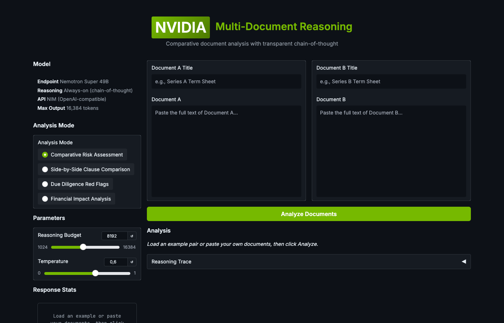

# Multi-Document Reasoning with NVIDIA Nemotron: When AI Reads Both Sides

Most LLM demos show a model answering a question about one document. That's table stakes. The harder problem is comparative reasoning — giving the model two documents and asking it to map differences, assess risk, and make a recommendation.

That's what this project does.



## In Short

I built a Gradio demo that takes two documents — term sheets, vendor proposals, employment offers, insurance policies — and runs them through NVIDIA's Nemotron Super 49B with chain-of-thought reasoning enabled.

The model doesn't just summarise. It maps clause to clause, identifies what's missing from each document, rates risk across dimensions, and produces a structured verdict with negotiation priorities.

The reasoning trace is fully visible. You can watch the model think through each comparison, weigh trade-offs, and arrive at its assessment. That transparency is the point.

## Why Multi-Document Reasoning Matters

Single-document analysis is a solved problem. Summarise a contract? Extract key terms? Any competent model handles that. The real enterprise need is comparison:

- **Which term sheet is more founder-friendly?** You need the model to hold both documents in context, identify every clause that differs, and assess each difference directionally.
- **Which vendor proposal carries more risk?** Not just "this one costs more" — which SLA is tighter, which warranty is longer, which scope gap could blow up at month 4?
- **Should I take the offer or the counter-offer?** The answer depends on how you weight equity vs cash, remote vs hybrid, acceleration clauses, non-competes, and a dozen other terms that interact with each other.

These are decisions that, today, require a lawyer or analyst to sit with both documents open, marking up differences paragraph by paragraph. It takes hours. An LLM with sufficient context and reasoning depth can produce a first-pass analysis in seconds that captures 90% of what that analyst would find.

Not as a replacement. As a force multiplier.

## Why Nemotron

Three things make Nemotron particularly suited to this task.

**1. Controllable reasoning depth.** Nemotron supports a reasoning budget parameter. For a quick comparison of two short clauses, you can set it low. For a comprehensive risk assessment of two 30-page contracts, you can push it to 16K tokens. The model allocates reasoning effort proportionally. This isn't just a nice-to-have — it's how you control cost and latency in production.

**2. Transparent chain-of-thought.** The reasoning trace is surfaced as a separate stream. You see the model's working, not just its conclusion. In regulated industries, this matters. When a compliance officer asks "why did the system flag this clause as high risk?" — you can show them the reasoning, step by step. That's audit-grade transparency.

**3. Context window.** Comparative reasoning is context-hungry. You're feeding two complete documents plus a structured prompt. Nemotron handles this without the quality degradation you see in some models when the context gets long. The analysis at token 10,000 is as sharp as the analysis at token 500.

## The Demo


The Gradio app has four pre-loaded example pairs:

| Example | What It Tests |
|---------|--------------|
| **Series A vs Series B Term Sheets** | Liquidation preferences, anti-dilution mechanics, board composition, protective provisions, drag-along thresholds |
| **Cloud Migration Proposals** | Fixed-price vs T&M, SLA comparison, team composition, warranty terms, scope differences |
| **Employment Offer vs Counter-offer** | Cash vs equity trade-offs, severance packages, non-competes, acceleration clauses, remote vs hybrid |
| **Standard vs Premium Cyber Insurance** | Coverage limits, exclusion differences, sub-limits vs full-limit coverage, ransomware inclusion, betterment costs |

Each pair can be analysed in four modes:

- **Comparative Risk Assessment** — Structured risk matrix with ratings across financial, operational, legal, and flexibility dimensions
- **Side-by-Side Clause Comparison** — Every clause mapped, classified as favorable/unfavorable/neutral/new/removed
- **Due Diligence Red Flags** — Ambiguities, one-sided terms, missing protections, deal-breakers
- **Financial Impact Analysis** — Quantified costs, contingent liabilities, best/worst case scenarios

You can also paste your own documents. The model handles any document type — it's not limited to the examples.

## What the Reasoning Trace Reveals

The most interesting part isn't the final analysis. It's watching how the model structures its comparison.

For the term sheet example, the reasoning trace shows the model:

1. First scanning both documents to identify the set of comparable terms
2. Noting where Document B introduces entirely new clauses (pay-to-play, redemption) that Document A doesn't address
3. Working through the liquidation preference math — 1x non-participating vs 1.5x participating with a 3x cap — and calculating the actual financial difference at various exit valuations
4. Flagging that the drag-along threshold dropped from 60% (preferred + common) to 50% (Series B alone) — a material governance shift
5. Identifying that Document B removes single-trigger acceleration and replaces it with board approval — a significant change that could easily be missed in a quick read

This is exactly the kind of systematic comparison that takes an analyst hours to produce manually. The model does it in 30-60 seconds, and the reasoning trace proves it considered each element rather than pattern-matching to a generic template.

## Architecture

The implementation is straightforward. No framework complexity.

```
User pastes two documents
    → System prompt sets the analysis persona
    → Documents injected into a structured comparison prompt
    → Nemotron streams response with reasoning trace separated
    → Gradio renders analysis (Markdown) and reasoning (styled trace panel)
```

The API call uses NVIDIA's NIM endpoint (OpenAI-compatible). Reasoning is enabled via `chat_template_kwargs` with `enable_thinking: True`. The reasoning content comes back as a separate stream attribute, keeping it cleanly separated from the final analysis output.

No vector database. No chunking. No retrieval pipeline. Both documents fit in context. The model reasons over them directly. For documents up to ~50 pages combined, this works without any infrastructure beyond the API call.

## The Enterprise Angle

Every legal team, procurement department, and investment firm does document comparison. Most of them do it manually or with tools that amount to glorified diff utilities — they find textual changes but can't assess their implications.

The gap this fills: **semantic comparison with risk assessment**. Not "these words changed" but "this change shifts the risk profile in this specific way, and here's why it matters."

The reasoning trace changes the conversation with stakeholders from "the AI says this is risky" to "here's the model's step-by-step analysis of why this clause creates exposure, with the specific numbers it used." That's the difference between a recommendation and evidence.

## Running It

```bash
export NVIDIA_API_KEY="your-key-here"
pip install gradio openai
python app.py
```

Open `http://localhost:7865`, load an example pair, click Analyze. The reasoning trace unfolds in real-time as the model works through the comparison.

The model is Nemotron Super 49B via NIM. The same approach works with any reasoning-capable model on the NIM platform — the architecture is endpoint-agnostic.

## What This Points To

Single-document AI is a commodity. Multi-document reasoning with transparent chain-of-thought is where the value moves.

The next step is obvious: multi-document reasoning over more than two documents. Compare five vendor proposals simultaneously. Cross-reference a contract against a regulatory framework and an internal policy document. Audit a portfolio of term sheets for consistency.

The reasoning architecture supports it. The context windows are getting there. The question isn't whether this becomes standard enterprise tooling — it's how fast.

---

*Chief Evangelist @ Kore.ai | I'm passionate about exploring the intersection of AI and language. Language Models, AI Agents, Agentic Apps, Dev Frameworks & Data-Driven Tools shaping tomorrow.*
